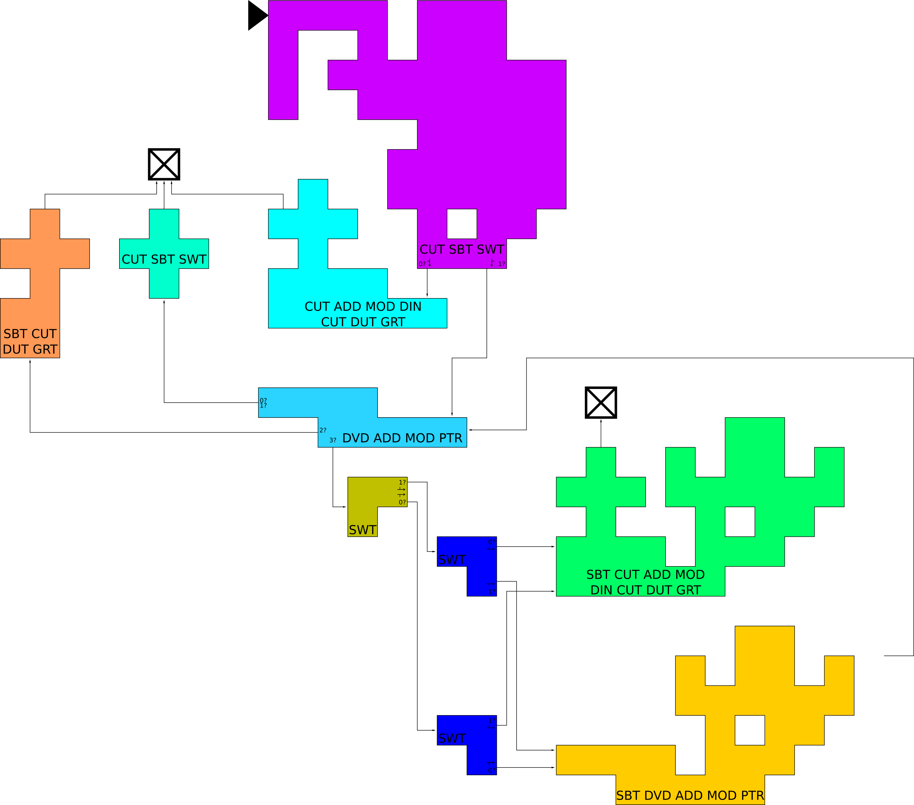

# Repiet: The Brutalizing Piet Recompiler

Repiet is a compiler for the [Piet](http://www.dangermouse.net/esoteric/piet.html)
graphical language, written in Python.  The name "repiet" is meant to convey that
it can recompile Piet programs into Piet.  Additionally, there are Python and C++
backends (more to come, and please contribute!).

To compile a Piet program, we lex it, parse it, and optionally perform some
optimizations.  The result of parsing and subsequent passes are parse graphs; our
intermediate representation.  The compiler (`repiet.compiler.compiler`)
collaborates with backends to grok this representation, and emit a program in a
target language.

We describe `repiet` as a "brutalizing recompiler" because it will take your
beautiful, hand-crafted Piet program and reconstruct it in a
[brutalist](https://en.wikipedia.org/wiki/Brutalist_architecture) style.  Who
knows why you'd want that.  The images referenced in this README are a somewhat
[randomly-generated Piet program](https://codegolf.stackexchange.com/a/3226) --
tweaked a little bit so it does *something* and also terminates.  Spoiler: it
takes a number from the user, emits the corresponding ascii character, and 
terminates, but spends most of its time NOPping.

## First Pass: Lexing

The lexer (`repiet.lexer.Lexer`) computes lexemes, or cardinally-connected sets
of same-colored pixels, and identifies whitespace and blocking features 
(by default, these are all pixels which are neither white nor coding colors; this
may be controlled through `opinions` described in `repiet.util`).  As the lexemes
are computed, we locate eight corners of each; corresponding to the  eight (`dp`,
`cc`) states.  As whitespace is located, we identify the 4 pixels reached by
sliding in each of four `dp` directions.

The role of the lexer is to eliminate pixel-based computations from subsequent
passes.

## Second Pass: Parsing

The parser begins in the upper-left corner of the image, and computes a parse
graph whose nodes correspond to (lexeme, `dp`, `cc`) states.  For each node, we
compute the operation (if any) resulting from the (`dp`, `cc`)-ward transition
from the lexeme, as well if the next visited lexeme (if any).  If the operation
 is `switch` or `pointer`, there are two or four possible next-visited lexemes
respectively.

The role of the parser is to eliminate the `dp` and `cc` from subsequent passes.
Thus, interpreters and compilers of the intermediate representations need only
grok parse graph, handle input, output, and other stack-based operations.

### Intermediate Representation

A parse graph is a [rooted digraph](https://en.wikipedia.org/wiki/Rooted_digraph)
containing Nodes (`repiet.util.Node`) which consist of a name, zero or more
operations, and a list of outgoing neighbor's names. To compile this
representation into another language, one need only implement the
[trampoline](https://en.wikipedia.org/wiki/Trampoline_(computing)) pattern.

A node may have zero, one, two, or four children.  These respectively correspond
to halting, jumping, and the `switch` or `pointer` operations.  Hence, a node's
operation list is constrained such that only the final operation may be `switch`
or `pointer`.  To implement these two operations, a compiled program pops a value
from the stack, takes that value modulo 2 or 4, respectively, and uses the result
as the index to the list of children.  If the stack is empty, the value is taken
to be zero.

The backends (`repiet.backends`) are quite rudimentary, and only grok this very
simple IR.  Thus, the only optimizations available to us are those which perform
surgery on parse graphs.

## Optimizing Passes

We implement a Tracer (`repiet.tracer.Tracer`) which collects a parse graph into
sequences of non-branching operations.  The result is a new parse graph, typically
with fewer nodes. Depending on the backend chosen, this may be a slight 
optimization.

Additionally, we implement a rudimentary Static Evaluator 
(`repiet.optimizer.StaticEvaluator`), which maintains compile-time stack while
tracing through instructions.  Presently, the static evaluator stops whenever the
program (a) takes input from the user, (b) tries to pop from an empty stack, or 
(c) attempts to roll beyond the depth of the stack. Further optimizations may be
possible: the values coming off of an empty stack could be treated as symbols,
for example.  Currently the backends are incapable of representing symbolic
variables, so such operations would require quite a bit of work.

The static evaluator is a work in progress, and it looks reasonable to interpose
a stack-depth analyzer between the tracer and static evaluator: the language spec
recommends skipping instructions that pop from an empty stack, which is especially
visible in this page's working example.  The existing static evaluator does not
drop those instructions, but they're apparently rare in hand-crafted or assembled
Piet programs.

# Installing and Using `repiet`

Repiet is a `python` package, with a standard `setup.py`.  To get the very latest,
fetch the git repo and install from there.

    git clone https://github.com/boothby/repiet.git
    cd repiet
    python setup.py install
 
Otherwise, just run `pip install repiet` and you're off to the races.  The primary
interface to `repiet` is the module's `__main__`, but you can also `import` it
`repiet` from python and poke around the module structure.  The `__main__` can be
used either as an executable python module,

    python -m repiet ...

or depending on how it's been installed, directly from the command line

    repiet ...

## But is it Faster Than C?

Yes!  Well, let's back up a minute for the folks missing context.  Recently there
have been a spate of blog posts of folks claiming that their pet language is
"faster than C" by implementing a feature-incomplete version of the 
[wc](http://man7.org/linux/man-pages/man1/wc.1.html) utility and running a single
benchmark to demonstrate superiority.

After cloning the `repiet` repo, point your command line at that directory.  We've
placed a `wc` utility into the `assets` directory, and we're going to time it
versus the `wc` supplied by my operating system (you don't need to know any
details about my system, of course).

    $ cd assets
    $ repiet wc.png -o wc.c --backend c
    $ gcc wc.c -o wc -Ofast
  
Okay, now our wc utility is built; let's grab some data to test.

    $ wget https://github.com/dwyl/english-words/raw/master/words_dictionary.json

Now, we're off to the races!  Don't worry, I didn't cherrypick these benchmarks
at all!

    $ time cat words_dictionary.json | wc -w
    740204

    real	0m0.145s
    user	0m0.136s
    sys	0m0.036s

Wow that's fast.  Now let's our hand-optimized Piet hotrod!

    $ time cat words_dictionary.json | ./wc
    740204
    real	0m0.131s
    user	0m0.140s
    sys	0m0.028s

Holy wowzers, that's extremely peppy!  Good thing I only ran those tests once,
and didn't show a distribution of runtimes!

So there you go, Piet is faster than C.  Tell your grandma.

# Notes on Style and Quality

This project was written purely for the amusement of the author.  Hence, the code
in this project is idiomatic and [golfed](https://en.wikipedia.org/wiki/Code_golf)
to a minor extent.  Where this could cause difficulty for the reader, extensive
comments have been written to explain what's going on.  Other folks have written
tools for Piet which use short-codes for various operations.  The 3-letter opcodes
used by `repiet` are probably not used elsewhere.

Also it might be worth pointing out that the author has never taken a course on
compilers, read a book about compilers, or generally done much more than read
basic definitions about compilers.  If somebody's got some well-reasoned opinions
about how this project sucks, please be nice, but do share.  Several parts are
significantly works in progress, and there are "tests" but they are not integrated
and do not provide a reasonable degree of coverage.

# Credits and License

The current version of this code is almost entirely the work of Kelly Boothby, and
distributed under the MIT license. If you look far enough back in the git history,
you'll find an interpreter written by Ross Tucker which is distributed on DMM's
website without any mention of licesnse.  That interpreter was hijacked, modified
into a rudimentary compiler, and deleted once obsolete.  Two lines of Ross's code
survive untouched, where the virtual machine performs a `roll` operation.  It is
the author's opinion that these lines fall under fair use.

Redistribution of Ross's code (which appears in early commits) is a bit of a grey
area, and we only claim copyright for the diffs to that code and for the other 
files in the repo.  If anybody knows Ross, and Ross takes issue with that code
living in the history, please submit an issue and we can revise history to make
good.
